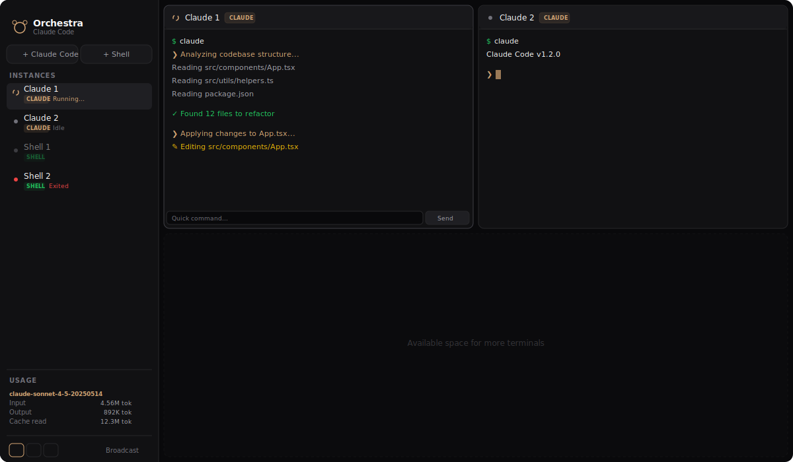
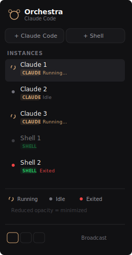
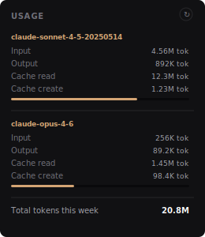

<div align="center">

# Claude Orchestra

### Run multiple Claude Code instances in parallel from one interface

[](https://opensource.org/licenses/MIT)
[](https://nodejs.org/)
[](https://docs.anthropic.com/en/docs/claude-code)
[]()
[]()

Launch, monitor and communicate with multiple [Claude Code](https://docs.anthropic.com/en/docs/claude-code) instances simultaneously. Terminal multiplexer for AI coding agents. Fully local, zero telemetry.



</div>

---

## Why Orchestra?

When working on complex projects, a single Claude Code instance isn't always enough. Orchestra lets you:

- Run **multiple Claude Code instances in parallel**, each on a different task
- See at a glance **who's working, who's waiting, who's finished**
- **Minimize** a terminal without stopping it - it keeps running in the background
- **Broadcast** a command to all terminals at once
- Track your **subscription quota** (session, weekly, extra) in real time with live monitoring
- Get **desktop notifications** when a terminal finishes its task
- **Drag & drop** to reorder terminals in the sidebar
- **Float** a terminal as a draggable, resizable overlay (picture-in-picture)
- **Pop out** a terminal into its own browser window
- **Resize** column panels with splitters
- Pass **custom arguments** to Claude Code (e.g. `--model sonnet`)

## 100% Local - No data sent anywhere

**Orchestra runs entirely on your machine.** No remote server, no telemetry, no tracking.

- The web server runs on `localhost` only
- Terminals are local processes (native PTY)
- Usage stats are read from `~/.claude/` local files
- Preferences are stored in `localStorage` in your browser
- **Zero outbound network requests** (except xterm.js CDN on first load)
- The code is open-source and auditable

---

## Screenshots

<table>
<tr>
<td width="60%">

### Sidebar - Terminal status
Each terminal shows its real-time state:
- **Gold spinner** - running / executing
- **Gray dot** - idle, waiting for input
- **Red dot** - process exited
- **Reduced opacity** - minimized (still running in background)

</td>
<td>



</td>
</tr>
<tr>
<td>

### Usage - Live quota monitoring
Real-time subscription quota tracking:
- Session (5h), weekly, and extra usage percentages
- Reset countdown timers
- Background watcher polls `/usage` every 2 minutes
- Per-terminal cost tracking for Claude instances

</td>
<td>



</td>
</tr>
</table>

---

## Installation

### Prerequisites

| Tool | Min. version | Check |
|------|-------------|-------|
| **Node.js** | 18+ | `node --version` |
| **Python** | 3.8+ | `python3 --version` (`python --version` on Windows) |
| **Claude Code** | - | `claude --version` |

### macOS / Linux

```bash
git clone https://github.com/emmanuellion/claude-orchestra.git
cd claude-orchestra
npm install
npm run dev
```

### Windows

```powershell
git clone https://github.com/emmanuellion/claude-orchestra.git
cd claude-orchestra
npm install
npm run dev
```

> **Windows note:** Python must be accessible via the `python` command in your PATH. If you use `python3`, create an alias or change the `PYTHON` variable in `server.js`.

### Then open

```
http://localhost:3000
```

---

## Usage

### Launching terminals

| Action | Description |
|--------|-------------|
| **+ Claude Code** | Opens a terminal and launches `claude` automatically |
| **+ Shell** | Opens a standard shell terminal (zsh/bash/cmd) |
| **+ PowerShell** | Opens a PowerShell terminal (Windows only) |
| **Args field** | Pass custom arguments to Claude Code (e.g. `--model sonnet`) |

### Managing terminals

| Button | Action |
|--------|--------|
| **Float** | Detaches the terminal as a draggable, resizable overlay |
| **Pop out** | Opens the terminal in a separate browser window |
| **Export** | Downloads the terminal output as a text file |
| **Lock** | Locks input to prevent accidental keystrokes |
| **Restart** | Kills and relaunches the terminal |
| **Minimize** | Hides the panel, the process keeps running in the background |
| **Close** | Terminates the process and removes the terminal |

### Layouts

| Icon | Mode | Description |
|------|------|-------------|
| Grid | **Grid** | Auto-adaptive grid layout |
| Cols | **Columns** | Terminals side by side, resizable with splitters |
| Tabs | **Tabs** | Single terminal visible, navigate via sidebar |

Auto-detection: 1 terminal = grid, 2 = columns, 3+ = grid.

### Sidebar

- **Drag & drop** items to reorder terminals
- **Click** an item to focus it (or switch tabs in tab mode)
- Each item shows: name, detected working directory, status, badge, and cost (for Claude instances)
- **WebSocket indicator** (green/yellow/red dot) in the header shows connection status

### Broadcast

Enable the **Broadcast** toggle in the footer to send the same command to **all** terminals simultaneously. Useful for:
- Running the same task across multiple projects
- Sending a global stop signal
- Testing a command in parallel

### Quick input

Each terminal has an input bar at the bottom. Type text and press **Enter** to inject a command without clicking inside the terminal. Arrow up/down for history.

### Quota monitoring

The **Usage** panel in the sidebar shows your Claude subscription limits:
- **Session** (5h window), **Weekly**, and **Extra** usage percentages
- Reset countdown timers for each quota
- Per-terminal cost tracking

Click **Start monitoring** to launch a background watcher that polls `/usage` every 2 minutes. Use the refresh button to trigger an immediate update, or the restart button to force restart the watcher.

### Notifications

When a terminal finishes its task (goes from busy to idle), Orchestra sends a **desktop notification** with the terminal name. Notifications are only sent when:
- You're on a different tab or another window is focused
- You've granted notification permission

Toggle notifications on/off with the **Notifs** switch in the footer.

### Settings

| Toggle | Description |
|--------|-------------|
| **Broadcast** | Send input to all terminals simultaneously |
| **Notifs** | Enable/disable desktop notifications |
| **Confirm** | Ask for confirmation before closing a terminal |

---

## Architecture

```
claude-orchestra/
├── server.js          # Express + WebSocket server + quota watcher
├── pty-helper.py      # Cross-platform PTY bridge (macOS/Linux/Windows)
├── quota-hook.js      # Status line hook for quota display
├── public/
│   ├── index.html     # Main page
│   ├── popout.html    # Pop-out terminal window
│   ├── style.css      # Styles (dark + light themes)
│   └── app.js         # Client WebSocket + xterm.js
├── docs/
│   └── *.svg          # Screenshots
├── package.json
└── README.md
```

### How it works

```
┌─────────────┐     WebSocket      ┌──────────────┐     stdin/stdout     ┌─────────────┐
│   Browser    │ ◄──────────────► │  server.js    │ ◄────────────────► │ pty-helper.py│
│  (xterm.js)  │                   │  (Express+WS) │                     │ (native PTY) │
└─────────────┘                    └──────────────┘                     └──────┬──────┘
                                                                               │
                                                                        fork / spawn
                                                                               │
                                                                       ┌──────▼──────┐
                                                                       │  zsh / bash  │
                                                                       │  / cmd.exe   │
                                                                       │  → claude    │
                                                                       └─────────────┘
```

1. The browser opens a WebSocket connection to the local server
2. For each new terminal, the server launches `pty-helper.py` (or uses `node-pty` on Windows)
3. The helper allocates a real PTY (Unix) or ConPTY (Windows)
4. The shell starts in the PTY, and optionally launches `claude`
5. All communication goes through stdin/stdout - **nothing leaves localhost**
6. Multiple browser windows can attach to the same terminal via the pop-out feature

### Compatibility

| OS | Default shell | PTY |
|----|--------------|-----|
| **macOS** | `$SHELL` (zsh) | `pty.openpty()` + `fork` |
| **Linux** | `$SHELL` (bash) | `pty.openpty()` + `fork` |
| **Windows** | `%COMSPEC%` (cmd) | `node-pty` (ConPTY) |

---

## Configuration

### Environment variables

| Variable | Default | Description |
|----------|---------|-------------|
| `PORT` | `3000` | Web server port |
| `SHELL` | `/bin/zsh` or `/bin/bash` | Shell to use (Unix) |
| `COMSPEC` | `cmd.exe` | Shell to use (Windows) |

---

## Development

```bash
# Development mode (auto-reload)
npm run dev

# Production mode
npm start
```

Dev mode uses `nodemon` to automatically reload the server on file changes.

---

## Security & Privacy

- **No data leaves your machine**
- No accounts, no third-party authentication
- No telemetry, no analytics
- No third-party cookies
- The server listens only on `localhost`
- The only outbound network connections are those made by Claude Code itself (to the Anthropic API), exactly as if you were using it directly in your terminal

---

## Contributing

Contributions are welcome! Feel free to open an issue or submit a pull request.

---

## Star History

If you find this project useful, please consider giving it a star on GitHub! It helps others discover it.

---

## License

MIT

---

<div align="center">
<sub>Built for developers who run multiple AI coding agents in parallel.<br>
Works with Claude Code, Anthropic CLI, and any terminal-based tool.</sub>
</div>
